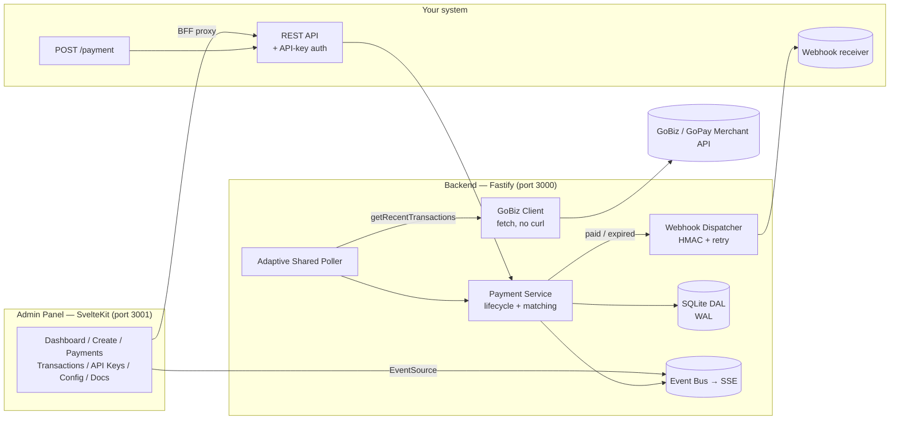

# GoPay Merchant QRIS Payment Gateway

<p align="center">
  
  
  
  
  
  
</p>

**A self-hosted service that turns a GoPay Merchant account into a programmable QRIS payment API — create dynamic QRIS, auto-detect settlement, and deliver signed webhooks (paid/expired).**

> In one line: a **self-hosted QRIS payment-gateway middleware on top of a GoPay Merchant (GoBiz) account.**

> [!WARNING]
> **Unofficial & use-at-your-own-risk.** This project is **not** affiliated with Gojek/GoPay and is **not** a licensed payment service provider (PJP). It rides on top of *your own* GoPay Merchant account by spoofing the GoBiz web headers and polling internal endpoints — which is outside GoBiz's Terms of Service. Aggressive polling or automated login can get your account **rate-limited or blocked**, and the upstream API can change without notice. Run it as a **private/internal tool**, never as a public "payment gateway".

---

## What it is (and isn't)

| It **is** | It is **not** |
|-----------|---------------|
| A payment-gateway-like **facade/middleware** over your GoPay Merchant wallet | A licensed payment gateway / PJP |
| Creates per-amount **Dynamic QRIS**, detects payment, fires **webhooks** | A fund mover — money lands in *your* GoPay wallet, not ours |
| Self-hosted REST API + admin panel | An official Gojek/GoPay product |

Money is never moved by this service. It **observes** your merchant transaction feed, **matches** incoming payins to the QRIS it generated, and **notifies** your systems — the same developer experience as a payment gateway, built on top of an account you already own.

---

## Architecture



- **Backend (`src/`)** — Node.js (ESM) + Fastify. Owns auth, payment lifecycle, the GoBiz integration, the adaptive poller, webhook delivery, and an SSE event stream. Storage is behind a storage-agnostic DAL (SQLite/`better-sqlite3` today).
- **Panel (`panel/`)** — SvelteKit + Tailwind admin UI, GoPay-flavored. Talks to the backend through a server-side BFF proxy (the Admin session cookie never leaves the server).

---

## Features

- 🧾 **Dynamic QRIS** — inject the amount into your static QRIS and recompute CRC16 (`010211 → 010212`, field `54`, `5802ID`).
- 🆔 **Two amount modes** — *client-managed* (you send the exact amount) or *server-managed* (you send a base amount; the system appends a unique `0..999` suffix).
- 🎯 **Atomic uniqueness** — a partial unique index guarantees no two pending payments share an amount; released amounts are reusable.
- 🛰️ **Adaptive shared poller** — a single poll loop for all active payments; window/interval adapt to load; fires the first poll immediately and stops when idle.
- 🔔 **Signed webhooks** — `paid` and `expired` events, HMAC-SHA256 `X-Signature` over the body, `X-Event` header, 5-attempt retry with backoff, full delivery log, and manual single-shot resend.
- ⚡ **Realtime panel** — Server-Sent Events push status changes instantly (with polling as a fallback).
- 🔐 **Security** — API-key auth for `/payment*`, hashed admin login with lockout + 24h session, GoBiz token encrypted at-rest (AES-256-GCM).
- 🌏 **Timezone-aware display** — stored as absolute epoch ms; rendered as offset-aware ISO (`Asia/Jakarta` by default, configurable per-payment via `tz` or globally via `display_timezone`).
- 🧪 **Heavily tested** — property-based tests (fast-check, ≥100 runs), unit/integration tests, and an English-only lint gate.

---

## Project structure

```
.
├── src/                     # Backend (Node.js ESM, Fastify)
│   ├── server.js            # Composition root: buildServer() / startServer()
│   ├── routes/              # payments.routes.js, admin.routes.js, schemas.js
│   ├── payment/             # payment-service, amount-allocator, qris-builder
│   ├── poller/              # shared-poller (adaptive, single instance)
│   ├── webhook/             # webhook-dispatcher (HMAC, retry) + hmac util
│   ├── gobiz/               # GoBiz integration: client, auth, transport, token-store, adapter
│   ├── dal/                 # storage-agnostic DAL + SQLite implementation
│   ├── auth/                # api-key + admin auth, hashing
│   ├── config/              # runtime-config (poll_interval, webhook_url, static_qris, display_timezone)
│   ├── events/              # in-process event bus (powers SSE)
│   ├── errors.js            # central error_code → { http, message } map
│   └── time.js              # epoch-ms ↔ offset-aware ISO helpers
├── panel/                   # Admin panel (SvelteKit + Tailwind, adapter-node)
│   └── src/routes/          # login, dashboard, create, payments, transactions, api-keys, config, docs
│   └── src/tests/           # panel component/route tests
├── scripts/                 # lint-language.mjs (English-only gate), manage-admin.mjs (admin CLI)
├── docs/API.md              # Full REST + webhook reference
├── data/                    # SQLite database (panel.db, WAL) — gitignored
├── start.mjs                # Backend entry for process managers (PM2)
└── ecosystem.config.cjs     # PM2: gopay-api + gopay-panel
```

> Backend tests live in `src/tests/`; panel tests in `panel/src/tests/`.

---

## Requirements

- **Node.js ≥ 18** (the panel runs under PM2 with `--env-file`, which needs **Node ≥ 20.6**).
- A working **GoPay Merchant (GoBiz)** account — email + password.
- Your merchant **static QRIS string** (configured later from the panel, not the env file).

---

## Quick start

```bash
# 1) Clone
git clone https://github.com/aditamagf/gopay-merchant.git
cd gopay-merchant

# 2) Install backend deps (repo root)
npm install

# 3) Install panel deps
cd panel && npm install && cd ..

# 4) Configure env (see Configuration below)
cp .env.example .env
cp panel/.env.example panel/.env
#   edit both .env files

# 5) Dev — run the two services in separate terminals
npm start                   # backend  -> http://localhost:3000  (node src/server.js)
cd panel && npm run dev     # panel    -> http://localhost:3001  (vite dev)

# 6) Production build (panel)
cd panel && npm run build   # builds with NODE_ENV=production (adapter-node)

# 7) Run under PM2 (both processes)
npx pm2 start ecosystem.config.cjs   # gopay-api + gopay-panel
npx pm2 status
npx pm2 restart gopay-api gopay-panel
npx pm2 save
```

Open the panel at `http://localhost:3001`, log in with your admin credentials,
then go to **Config** and paste your **static QRIS** string. Create an API key
from **API Keys** and put it in `panel/.env` as `PANEL_API_KEY`.

---

## Configuration

> **Generating secrets.** For `MASTER_KEY`, `WEBHOOK_HMAC_KEY`, and
> `ADMIN_SESSION_SECRET`, use a long random value — e.g. `openssl rand -hex 32`.
> Never reuse the examples, and never commit your real `.env` (both are
> gitignored).

### Backend — `.env`

| Variable | Required | Description |
|----------|----------|-------------|
| `GOPAY_EMAIL` | ✅ | GoBiz / GoPay Merchant login email. |
| `GOPAY_PASSWORD` | ✅ | GoBiz / GoPay Merchant password. |
| `MASTER_KEY` | recommended | Key for encrypting the GoBiz token at-rest (`.gopay_token.enc`, AES-256-GCM). If absent, the token is stored as plaintext `0600` with a warning. |
| `WEBHOOK_HMAC_KEY` | ✅ | HMAC-SHA256 key used to sign outgoing webhooks (`X-Signature`). |
| `ADMIN_SESSION_SECRET` | ✅ | HMAC secret for signing admin session tokens. The server refuses to start with an empty value. |
| `ADMIN_USERNAME` | seed | Admin username, seeded on first boot. |
| `ADMIN_PASSWORD` | seed | Admin password, seeded (hashed) on first boot. |
| `PORT` | optional | Backend listen port (default `3000`). |
| `HOST` | optional | Backend bind host (default `0.0.0.0`). |
| `DB_PATH` | optional | SQLite database path (default under `data/`). |
| `TOKEN_FILE_PATH` | optional | Encrypted GoBiz token path (default `.gopay_token.enc`). |
| `NODE_ENV` | optional | When `production`, marks the admin session cookie `Secure` (HTTPS only). Leave unset to allow plain `http://IP:port`. |
| `TZ` | optional | Process timezone for local-time formatting (PM2 pins `Asia/Jakarta`). Stored timestamps stay UTC epoch ms. |

### Panel — `panel/.env`

| Variable | Required | Description |
|----------|----------|-------------|
| `API_BASE` | ✅ | Base URL the panel BFF uses to reach the backend (default `http://localhost:3000`). Never exposed to the browser. |
| `PANEL_API_KEY` | ✅ | Server-held API key the panel uses to call the API-key-protected payment endpoints. Read only on the panel server. |
| `ORIGIN` | ✅ (prod) | Public origin the browser hits (e.g. `http://1.2.3.4:3001` or `https://panel.example.com`). Required by adapter-node's CSRF check on the login POST — without it, plain-http logins fail with 403 "Cross-site POST form submissions are forbidden". |
| `PORT` | optional | Panel listen port (default `3001`). |
| `HOST` | optional | Panel bind host (default `0.0.0.0`). |
| `NODE_ENV` | optional | `production` marks the admin cookie `Secure`. Independent from build-time `NODE_ENV`. |

### Runtime config (managed from the panel **Config** page)

| Setting | Description |
|---------|-------------|
| `static_qris` | Your merchant's static QRIS string; amounts are injected into it per payment. |
| `poll_interval` | Base poll interval (ms) for the shared poller. Changes apply on save — **no restart needed**. |
| `webhook_url` | Default webhook target when a payment doesn't specify its own. |
| `display_timezone` | Default IANA timezone for rendering `*_iso` fields (default `Asia/Jakarta`). |

---

## Deployment

### Render Web Service

The repository includes [render.yaml](./render.yaml) for deploying the
backend API as a Render Web Service. It uses Render's injected PORT, binds
to 0.0.0.0, and exposes GET /health for Render health checks.

The Blueprint is configured for the Free plan so it can be used for an initial
deployment test. Render Free services are not suitable for real payments:
they sleep after inactivity and their local filesystem is ephemeral. This
service stores payment state in SQLite and the GoBiz access token on disk, so
data can be lost after a restart, redeploy, or sleep.

For a paid Render deployment:

1. Upgrade the service to a paid instance.
2. Attach a persistent disk mounted at /var/lib/gopay.
3. Set these Render environment variables:
   DB_PATH=/var/lib/gopay/panel.db
   TOKEN_FILE_PATH=/var/lib/gopay/.gopay_token.enc
4. Set all secret variables from render.yaml in the Render dashboard.
5. Use the resulting HTTPS service URL as the backend URL in AutoBeli.

The admin panel is not included in the Render Blueprint. Keep it private or
deploy it as a separate service; AutoBeli only needs the backend API.

Two supported topologies. Both run the **backend** (`gopay-api`, port `3000`) and
the **panel** (`gopay-panel`, port `3001`) under PM2. The panel reaches the
backend over `localhost`; only the panel (and, if you have external API clients,
the backend REST API) needs to be reachable from outside.

### Prerequisites (both)

```bash
# Build the panel once (adapter-node output in panel/build)
cd panel && npm run build && cd ..

# Start both services and persist the process list
npx pm2 start ecosystem.config.cjs
npx pm2 save
# Make PM2 resurrect them on reboot (run the command it prints)
npx pm2 startup
```

### Option A — VPS with IP:port (no domain, plain HTTP)

Good for a quick private deploy. You reach the panel at `http://SERVER_IP:3001`.

1. **Backend `.env`** — leave `NODE_ENV` unset (so the admin cookie is not marked
   `Secure`, which would require HTTPS):
   ```dotenv
   PORT=3000
   HOST=0.0.0.0
   # NODE_ENV stays unset
   ```
2. **Panel `.env`** — set `ORIGIN` to exactly the URL you type in the browser, and
   keep `NODE_ENV=development` (plain HTTP):
   ```dotenv
   API_BASE=http://127.0.0.1:3000
   PORT=3001
   HOST=0.0.0.0
   NODE_ENV=development
   ORIGIN=http://SERVER_IP:3001
   PANEL_API_KEY=...   # created from the API Keys page
   ```
3. **Open the firewall** for the panel (and the backend only if external API
   clients call it directly):
   ```bash
   # ufw example
   sudo ufw allow 3001/tcp
   sudo ufw allow 3000/tcp   # only if API clients hit the REST API directly
   ```
4. Restart the panel so it picks up `ORIGIN`:
   ```bash
   npx pm2 restart gopay-panel --update-env
   ```

External API clients call the REST API at `http://SERVER_IP:3000/payment`.

> Setting `ORIGIN` matters: without it adapter-node assumes `https://` and rejects
> the plain-HTTP login with `403 Cross-site POST form submissions are forbidden`.

### Option B — Domain + nginx + HTTPS (recommended for production)

Put nginx in front, terminate TLS, and proxy to the two local services. Example:
`panel.example.com` for the admin UI and `api.example.com` for the REST API.

1. **Panel `.env`** — HTTPS origin + production cookie:
   ```dotenv
   API_BASE=http://127.0.0.1:3000
   PORT=3001
   HOST=127.0.0.1          # bind to localhost; nginx is the only public entry
   NODE_ENV=production      # marks the admin session cookie Secure
   ORIGIN=https://panel.example.com
   PANEL_API_KEY=...
   ```
2. **Backend `.env`** — bind to localhost and enable Secure cookies:
   ```dotenv
   PORT=3000
   HOST=127.0.0.1
   NODE_ENV=production
   ```
3. **nginx — panel** (`panel.example.com`). Note the dedicated `/api/events`
   block so Server-Sent Events stream instead of being buffered:
   ```nginx
   server {
       server_name panel.example.com;

       location / {
           proxy_pass http://127.0.0.1:3001;
           proxy_http_version 1.1;
           proxy_set_header Host $host;
           proxy_set_header X-Real-IP $remote_addr;
           proxy_set_header X-Forwarded-For $proxy_add_x_forwarded_for;
           proxy_set_header X-Forwarded-Proto $scheme;
       }

       # Server-Sent Events (realtime) — disable buffering so events stream.
       location /api/events {
           proxy_pass http://127.0.0.1:3001;
           proxy_http_version 1.1;
           proxy_set_header Host $host;
           proxy_set_header Connection '';
           proxy_buffering off;
           proxy_cache off;
           proxy_read_timeout 3600s;
       }
       # listen / TLS lines are added by certbot (below)
   }
   ```
4. **nginx — REST API** (`api.example.com`), for machine-to-machine clients:
   ```nginx
   server {
       server_name api.example.com;
       location / {
           proxy_pass http://127.0.0.1:3000;
           proxy_http_version 1.1;
           proxy_set_header Host $host;
           proxy_set_header X-Forwarded-For $proxy_add_x_forwarded_for;
           proxy_set_header X-Forwarded-Proto $scheme;
       }
   }
   ```
5. **TLS with certbot**, then reload:
   ```bash
   sudo certbot --nginx -d panel.example.com -d api.example.com
   sudo nginx -t && sudo systemctl reload nginx
   ```
6. Restart both services so the new env is applied:
   ```bash
   npx pm2 restart gopay-api gopay-panel --update-env
   ```

Now the panel is at `https://panel.example.com` and the REST API at
`https://api.example.com/payment`. Only ports 80/443 need to be open publicly;
`3000`/`3001` stay bound to localhost.

---

## Managing the admin account

`ADMIN_USERNAME` / `ADMIN_PASSWORD` in `.env` only **seed** the admin on first
boot (when that user does not exist yet). Afterwards the credentials live as a
scrypt hash in `data/panel.db`, so editing `.env` has no effect. Use the bundled
utility to change them (run from the repo root):

```bash
# List existing admins (and lock state)
node scripts/manage-admin.mjs --list

# Change password
node scripts/manage-admin.mjs --user admin --password 'new-strong-password'

# Rename the admin
node scripts/manage-admin.mjs --user admin --new-username newname

# Change both at once
node scripts/manage-admin.mjs --user admin --new-username newname --password 'new-strong-password'

# Create the admin if it does not exist yet
node scripts/manage-admin.mjs --user admin --password 'new-strong-password' --create
```

The password is hashed with the app's own scrypt encoder (login-compatible), and
every update also clears failed-attempt/lockout counters (handy to unlock a
locked-out account). No restart is needed — logins read the row fresh.

---

## How it works

1. **Create** — `POST /payment` with an amount. The system allocates a unique
   pending amount, injects it into your static QRIS (recomputing CRC16), stores
   the payment, and returns the QRIS string + PNG immediately.
2. **Poll** — a single adaptive poller fetches recent merchant transactions from
   GoBiz. It starts on the first active payment (firing the first poll right
   away) and stops when there are none.
3. **Match** — incoming payins are matched to pending payments by amount (within
   tolerance). A match flips the payment to `paid`.
4. **Expire** — payments past their lifetime are swept to `expired` atomically.
5. **Notify** — `paid` and `expired` transitions fire a signed webhook and emit
   an SSE event so the panel updates in realtime.

---

## REST API

API-key auth (`Authorization` / API-key header) on every `/payment*` route.

| Method | Path | Purpose |
|--------|------|---------|
| `POST` | `/payment` | Create a pending payment; returns dynamic QRIS + PNG URL. |
| `GET` | `/payment/:id` | Fetch a single payment's current state. |
| `GET` | `/payments` | List active (`pending`) payments, soonest-expiry first. |
| `GET` | `/payment/:id/qris.png` | The payment's QRIS rendered as a PNG. |

`POST /payment` supports **client-managed** (`amount`) and **server-managed**
(`base_amount` + auto suffix) modes, an optional per-payment `webhook_url`, and
an optional `tz` for offset-aware `*_iso` fields.

Full request/response shapes, error codes, and examples: see
[`docs/API.md`](docs/API.md) and the in-panel **Docs** page (`/docs`).

---

## Webhooks

- **Events:** fired on `paid` and `expired` (mutually exclusive — at most one
  terminal webhook per payment).
- **Headers:** `X-Signature` = `HMAC-SHA256(rawBody, WEBHOOK_HMAC_KEY)` (lowercase
  hex), and `X-Event` = `paid` | `expired`.
- **Body:** includes `payment_id`, `payment_status`, `amount`, and epoch +
  offset-aware `*_iso` timestamps (with `tz`).
- **Delivery:** up to **5 attempts** with backoff, 10s per-attempt timeout. Every
  attempt is logged and viewable in the panel, where you can **Resend** (a
  single, no-retry attempt).
- **Target selection:** payment's own `webhook_url` → Config default
  `webhook_url` → if neither exists, nothing is sent (not an error).

Always verify `X-Signature` with a constant-time comparison before trusting a
payload. See `docs/API.md` for Node/PHP/Python handler examples.

---

## Realtime (SSE)

The panel subscribes to `GET /admin/events` (proxied through the BFF) and updates
the **Create** and **Payments** views the instant a payment settles or expires.
Polling remains as a fallback, so realtime is a pure enhancement.

> **Behind nginx:** the SSE endpoint needs `proxy_buffering off` on the
> `/api/events` location, otherwise events are buffered and the panel won't update
> live. See the nginx config in [Deployment → Option B](#option-b--domain--nginx--https-recommended-for-production).

---

## Admin panel

GoPay-flavored SvelteKit UI (vertical sidebar, brand-blue palette):

- **Dashboard** — at-a-glance merchant + poller status.
- **Create** — make a payment and watch its status flip in realtime.
- **Payments** — active/recent payments, with Payment Detail and live Transaction
  Detail drawers and the webhook delivery log (+ resend).
- **Transactions** — live merchant transaction feed.
- **API Keys** — create/revoke keys for the REST API.
- **Config** — static QRIS, poll interval, webhook URL, display timezone.
- **Docs** — the REST + webhook reference, in-app.

---

## Testing

```bash
# Backend: unit + integration + property-based (fast-check) tests
npm run test

# English-only lint gate (Requirement 16)
npm run lint:lang

# Panel: component/route tests
cd panel && npm run test
```

The backend suite includes property-based tests (fast-check, ≥100 runs) covering
QRIS/CRC, amount allocation, and response shapes. An English-only lint gate keeps
all code, UI text, comments, and logs in English.

---

## Security notes

- API-key auth on all `/payment*` routes; hashed admin login with lockout and a
  24h session.
- GoBiz token encrypted at-rest (AES-256-GCM) via `MASTER_KEY`.
- Admin session secret is mandatory; the server won't boot with an empty one.
- The panel talks to the backend server-side (BFF) — the admin cookie and
  `PANEL_API_KEY` never reach the browser.
- Serve over HTTPS in production and set `NODE_ENV=production` so the session
  cookie is marked `Secure`.

---

## Troubleshooting

**Login returns `403 Cross-site POST form submissions are forbidden`.**
The panel's `ORIGIN` doesn't match the URL in your browser. Set `ORIGIN` in
`panel/.env` to the exact `scheme://host:port` you open (e.g.
`http://SERVER_IP:3001` or `https://panel.example.com`), then
`npx pm2 restart gopay-panel --update-env`.

**Login succeeds but immediately bounces back / session doesn't persist.**
The admin cookie is marked `Secure` but you're on plain HTTP. Keep
`NODE_ENV=development` in `panel/.env` for HTTP access, or serve over HTTPS and
set `NODE_ENV=production`.

**Logout does nothing.** Same root cause as above — over plain HTTP the browser
rejects the `Secure` cookie clear. Ensure `NODE_ENV` is not `production` when on
HTTP.

**Changed `ADMIN_PASSWORD` in `.env` but the old password still works.**
Expected: `.env` only seeds on first boot. Use
`node scripts/manage-admin.mjs --user <name> --password <new>` (see
[Managing the admin account](#managing-the-admin-account)).

**Locked out after too many attempts.** Any `manage-admin.mjs` update clears the
lockout, e.g. resetting the password unlocks the account.

**Panel doesn't update in realtime.** Behind nginx, add `proxy_buffering off` to
the `/api/events` location (see Deployment → Option B). Polling still refreshes
within a few seconds as a fallback.

**`PANEL_API_KEY` empty / Create & live pages fail.** Log in, create a key on the
**API Keys** page, put it in `panel/.env` as `PANEL_API_KEY`, then restart the
panel.

**First payment after an idle period is slow (3–5s).** The GoBiz session warms up
on the first poll after login. Subsequent polls are fast; this is inherent to the
upstream login flow.

---

## Disclaimer

This is an **unofficial**, self-hosted tool that operates on **your own** GoPay
Merchant account. It is **not** affiliated with or endorsed by Gojek/GoPay and is
**not** a licensed payment service provider. Using it may violate GoBiz's Terms of
Service and can result in rate-limiting or account suspension. The upstream API
can change at any time. **Use at your own risk**, as a private/internal tool only.

---

## License

[MIT](LICENSE).
